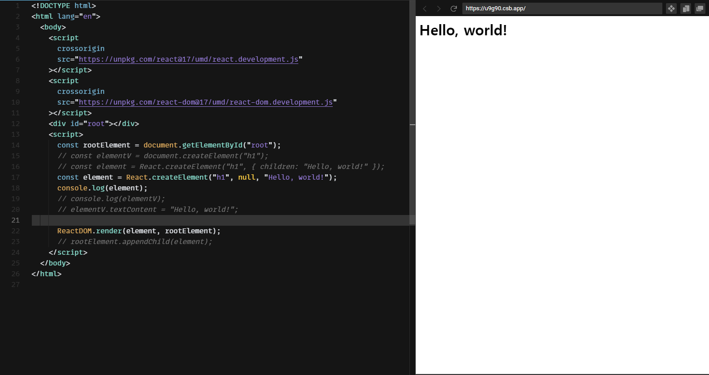
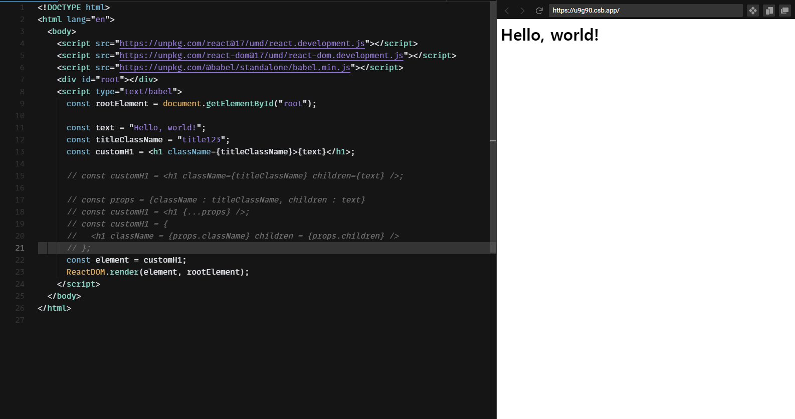

# 1일차

- 라이브러리 vs 프레임워크
  - 라이브러리 = 개별 편의를 위한 도구의 모음, 공구
  - 프레임워크 = 기반 구조까지 잡혀있음, 공장

- React =>  라이브러리!!

- Virtual DOM / JSX / Flux / Functional Programming ... 장점들이 많다...!!

## Dom 다루기 / Element 생성하기

- DOM = Document Object Model (문서 객체 모델) = 문서를 논리 트리로 표현한다.
- Vanilla JS = 순수 자바 스크립트 = 특정 라이브러리나 프레임워크를 사용하지 않은 순수 자바스크립트

- CDN = Content Delevery Network => 웹에서 사용되는 다양한 컨텐츠를 저장하여 제공하는 시스템
- https://codesandbox.io/ 를 활용하여 실습!! 

## JSX와 Bable / JSX 다루기

- JSX => 문자도 HTML도 아닌 JavaScript 확장 문법 => React.createElement 표현식

  ex ) const element = <h1>Hello, world!</h1>

- Bable => JavaScript Complier

