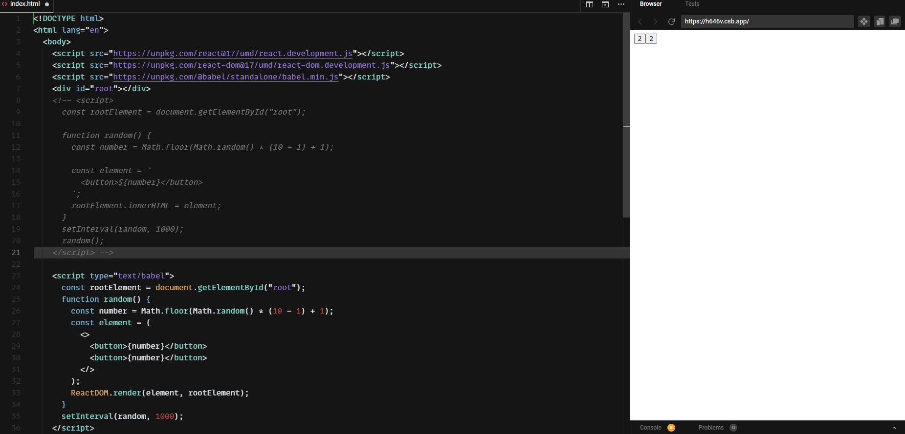

# 리액트와 리랜더링 알아보기

바닐라 JS => 변경으로 인해 Element를 다시그림

React => 변경된 부분만 다시 그림

- React  앨리먼트는 불변객체 (immutable)이다. 우리는 그저 ReactDOM.render(element, rootElement) 로 전달할 뿐 변경 판단 및 반영은 리액트가 알아서 한다.
- 앨리먼트 타입이 바뀌면 => 새로그림 , 앨리먼트 타입이 같다면 => key를 먼저 비교하고 props를 비교해서 변경사항을 반영! // virtual Dom을 비교할 시 활용한다.

