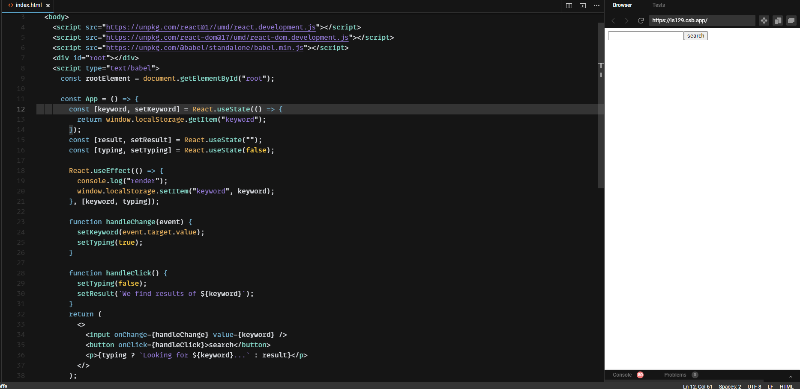
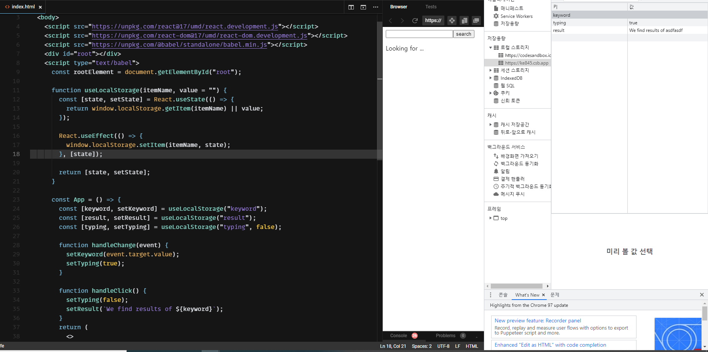

# 이벤트 핸들러 써보기

리액트 JS => on{Event} 

ex) onClick, onMouseOut

## 간단한 검색창 만들어보기

input/button

onChange / onClick 

+

전역변수

## 컴포넌트 상태 다루기

- useState("")

## 컴포넌트 사이드 이펙트 다루기

- useEffect => 부수 효과

  

useEffect 두 번째 인자로 리스트를 받는데 리스트 안에 있는 값이 변경될 때마다 useEffect가 실행됨!! 

인자를 따로 안 주는 경우에는 모든 변화에 반응! 빈리스트 인 경우에는 처음 랜더링에만 반응!

## 커스텀 훅 만들기

찍어내기/ 반복 = > 함수화

useState / useEffect 를 반복 => 커스텀 훅

