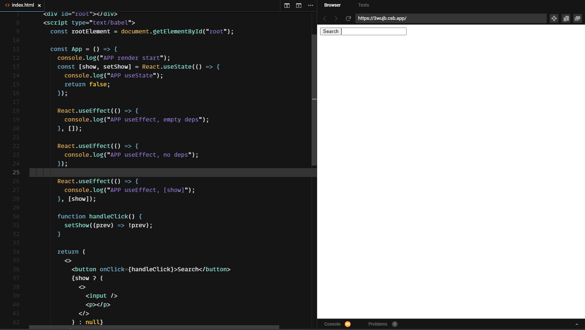
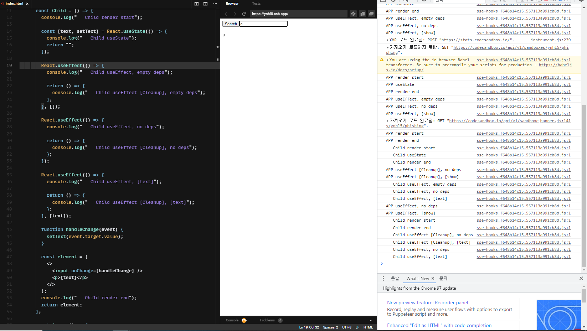

## Hook Flow 이해하기 

 

useEffect => render가 끝난 뒤에 실행

update시 => useEffect cleanup 후 useEffect

dependency array => 전달받은 값의 변화 있는 경우에만

- useEffect 는 children의 useEffect가 먼저 실행된다. cleanup은 부모 먼저!

